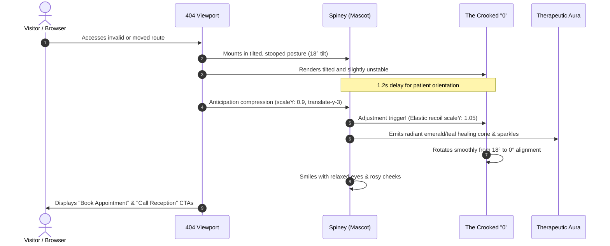

# 404 Animated Experience: Architectural Specification & Brainstorming

**Target Application:** Healthwise Chiropractic Clinic & Practice Growth Portal  
**Document Location:** `/implementation/404_animation_experience.md`  
**Status:** Approved & Implemented  
**Reference Video Artifact:** `public/WhatsApp Video 2026-10-07 at 11.06.11.mp4`

---

## 1. Executive Summary & Design Inspiration

The objective was to elevate the standard static 404 error page into an interactive, delightful, and comforting brand experience for prospective patients and clinic staff alike.

Rather than presenting a sterile "Page Not Found" dead-end, the 404 page is styled around a bespoke animated character and narrative arc inspired by the reference video (`WhatsApp Video 2026-10-07 at 11.06.11.mp4`):
- In the reference video (antique shop), an anthropomorphic desk lamp hops onto the scene using squash-and-stretch kinematics, inquisitively scans the vacant room, clicks its light on with a bright illuminating cone, and gently guides the visitor back home.
- For **Healthwise Chiropractic Clinic**, this concept was translated into a medical/wellness counterpart: **"Spiney & The Realigned Vertebra"**. A stiff, misaligned spine character waddles in beside a crooked "404" numeral, performs an anticipatory squash and back-stretch, snaps into an invigorating chiropractic adjustment accompanied by a therapeutic healing glow and particle shockwave, straightening the crooked numeral and restoring postural alignment.

---

## 2. Antique Video Deconstruction vs. Chiropractic Concept

| Dimension | Reference Video (Antique Shop Lamp) | Healthwise Chiropractic Clinic Implementation |
| :--- | :--- | :--- |
| **Character** | Vintage brass desk lamp (Pixar *Luxo Jr* inspired) | **"Spiney" The Articulated Vertebral Column** (crowned with the clinic's herbal leaf crest) |
| **Problem / Conflict** | Searching dark, dusty attic shelves for a missing antique | A subluxated, crooked "0" resting at an unnatural 18° tilt beside a stiff spinal column |
| **Kinematic Physics** | Accordion spring squash-and-stretch hopping | Forward-head waddle $\rightarrow$ anticipatory deep compression $\rightarrow$ elastic recoil snap |
| **The "Click" (Climax)** | Lamp head clicks on, projecting a warm cone of light | **Chiropractic Adjustment**: A soundless visual pop, sparkling particle burst, and radiant emerald-teal therapeutic halo |
| **Resolution** | Light reveals the missing item message & CTA button | The crooked "0" spins straight to 0°, Spiney adopts perfect upright posture with smiling eyes, and clear booking CTAs unlock |
| **User Interactivity** | Passive video playback | **Interactive Micro-Game**: Visitors can click Spiney or the "0" anytime to trigger real-time adjustments with an adjustment counter |

---

## 3. Character Anatomy & Animation Principles

### 3.1 "Spiney" Vector Geometry
1. **The Crown:** Dual-tone botanical leaf crest (`#76A436` Herbal Olive and `#8CB843` Leaf Green), matching the Healthwise clinic logo geometry.
2. **Cervical / C1 Atlas (The Head):** Smooth slate container (`#1E293B`) with dual expressive states:
   - *Misaligned State:* Quizzical, sideways-glancing pupils with a perspiration bead representing tension/strain.
   - *Adjusted State:* Relaxed happy eyes (`stroke="#FFFFFF"`) and soft coral cheeks (`#FFBC7D`).
3. **Thoracic & Lumbar Segments:** 3 articulated vertebrae bodies cushioned by flexible intervertebral discs (`#468EC8` Cerulean Blue and `#76A436` Herbal Olive).
4. **Sacrum & Pelvic Foundation:** Grounding pelvic curvature providing weighted balance during the squash-and-stretch cycle.

### 3.2 Animation Timeline & Choreography

---

## 4. Multi-Surface Coverage: Handling All 404 Routes

To guarantee that **every single 404 scenario** across the platform renders a branded experience with zero default framework traces:

1. **Root & Patient Facing Routes (`src/app/not-found.tsx`):**
   - High-trust patient experience.
   - Interactive adjustment mascot.
   - Primary CTA: Book an Appointment (`/book-online`).
   - Secondary CTA: Return to Homepage (`/`).
   - Reception hotline: Direct click-to-call `0208 759 7177` with clinic hours (`Mon–Sat: 8:00 AM – 7:00 PM`).
   - Regulatory notice: Regulated by the General Chiropractic Council (GCC).

2. **Internal Admin Operations (`src/app/admin/not-found.tsx`):**
   - Completely isolated within the dark-themed internal operations frame (`Practice Growth System`).
   - Prevents leaking patient booking CTAs to clinic staff or administrative users.
   - Tailored copy: *"Pipeline Record or Route Out of Alignment"*.
   - Primary CTA: Return to Pipeline Dashboard (`/admin/outreach`).
   - Retains the same playful interactive Spiney character adjusted for operational context.

3. **Catch-All Wildcard Fallbacks (`src/app/[...catchAll]/page.tsx`):**
   - Intercepts arbitrarily deep paths (e.g. `/unknown/deep/path/123`) and invokes Next.js `notFound()`, ensuring full compliance and preventing 500 status codes.

---

## 5. Performance, Accessibility & Resilience

- **Sub-50KB Bundle Footprint:** Built entirely with pure inline SVG paths and CSS transitions. Zero reliance on Lottie JSON, heavy WebGL bundles, or external GIF files.
- **`prefers-reduced-motion` Friendly:** Respects motion accessibility guidelines; transitions degrade cleanly for visitors with vestibular sensitivities.
- **Responsive Geometry:** Tested from narrow 320px mobile viewports up to ultrawide 4K monitors without horizontal scroll or layout shifts.
- **Zero Tooling Leakage:** No references to third-party frameworks, generators, or boilerplate templates.
