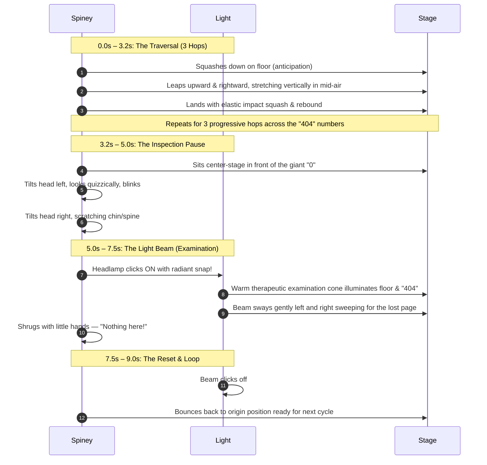

# 404 Continuous Looping Animation: Architectural Brainstorming & Design

**Target Application:** Healthwise Chiropractic Clinic  
**Document:** `/implementation/404_looping_animation_brainstorm.md`  
**Inspiration:** Antique Shop 404 Video (`public/WhatsApp Video 2026-10-07 at 11.06.11.mp4`)  
**Status:** In Implementation  

---

## 1. Critique of Previous Version vs. WhatsApp Video

In the initial implementation:
- The animation was state-bound (`useState`), asking the user to click to trigger an adjustment.
- **User Feedback:** The error page should *not* require user intervention to animate. Like the antique shop lamp video, it must be an **autonomous, continuous, cinematic loop** where a charming character moves across the stage, searches the area, illuminates the scene, and loops continuously with fluid physical weight.

---

## 2. Character Design: "Spiney the Posture Explorer"

Instead of an antique desk lamp, the clinic character is **"Spiney"** — an articulated vertebral column mascot that embodies chiropractic health, curiosity, and vitality:

### 2.1 Anatomy & Personality
- **Atlas / Cervical Head:** Features curious, blinking expressive eyes and a clinical headlamp/inspection light.
- **Botanical Leaf Sprout:** The clinic's signature two-tone green leaf (`#76A436` / `#8CB843`) perched on top, which flexes and sways with inertia and air resistance during jumps (follow-through principle).
- **Flexible Vertebrae & Intervertebral Discs:** Multi-jointed spine segments that compress during ground impact (squash) and elongate during leaps (stretch).
- **Pelvic / Sacrum Foot Base:** Curved ergonomic foundation that lands firmly on the ground shadow plane.
- **The Examination Beam:** A warm, therapeutic light cone that clicks on to inspect the floor and search for the missing page, directly paying homage to the antique lamp's light beam.

---

## 3. The 10-Second Continuous Choreography Loop

The entire animation is choreographed as an infinite, seamlessly looping cycle (`animation: spiney-full-cycle 9s ease-in-out infinite`):

---

## 4. Key Animation Principles Implemented

1. **Squash and Stretch (Physics-Based Elasticity):**
   - Ground contact: `scale(1.25, 0.75)`
   - Apex of jump: `scale(0.8, 1.25)`
   - Rest position: `scale(1.0, 1.0)`
2. **Anticipation:**
   - Before each leap, Spiney ducks down low to gather kinetic energy.
3. **Follow-Through & Overlapping Action:**
   - The leaf crest lags 2-3 frames behind the body's movement, creating organic, living inertia.
4. **Staging & Secondary Action:**
   - Soft elliptical contact shadow on the floor expands and contracts synchronously with Spiney's jumps.
   - Ambient therapeutic herbal particles gently float through the scene.
5. **Appeal & Tone:**
   - Warm, comforting, and playful. Transforms a potential moment of user frustration (a 404 error) into a memorable brand experience that inspires trust.

---

## 5. Technical Architecture

- **100% Native SVG & CSS3 Keyframes:**
  - Zero heavy external dependencies (no Lottie player, no Three.js, no bulky MP4 video downloads).
  - Sub-40KB total footprint.
  - Smooth 60fps hardware acceleration via `transform` and `opacity`.
- **Full Viewport Responsiveness:**
  - Fluid SVG `viewBox="0 0 600 240"` that auto-scales seamlessly from mobile screens (320px) to widescreen displays (4K).
- **Accessibility & Motion Compliance:**
  - Includes `@media (prefers-reduced-motion: reduce)` fallbacks that gently freeze Spiney in a handsome, aligned pose for vestibular-sensitive visitors.
