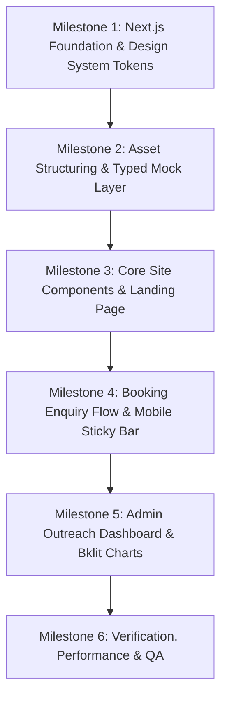

# Healthwise Chiropractic Clinic Rebuild & Outreach Admin Dashboard
## Implementation Kickstart & Master Architectural Specification

**Target Clinic:** Healthwise Chiropractic Clinic  
**Address:** 730 Bath Rd, Cranford, Hounslow TW5 9TW, United Kingdom  
**Phone:** 0208 759 7177 (`tel:+442087597177`)  
**Existing Website:** [healthwisechiropracticclinic.com](https://www.healthwisechiropracticclinic.com/)  
**Technology Framework:** Next.js (App Router), React, TypeScript, Tailwind CSS, Shadcn UI, Bklit Charts  
**Scope:** Frontend First (Landing Page + Supporting Pages Structure + Internal Outreach Admin Dashboard with Typed Mock Data Layer)  
**Status:** Brainstorming & Architecture Complete — Ready for Build Approval (Gate 1, 2, 3)

---

## 1. Executive Summary, Project Goal & Scope

### 1.1 Goal
Prepare a high-conversion, demo-ready web application for an upcoming client presentation. The deliverable consists of:
1. **A rebuilt patient-facing website** for Healthwise Chiropractic Clinic that remedies all 7 critical audit defects, completely eliminates the amateur "vibecoded/AI-generated" aesthetic, complies strictly with UK Advertising Standards Authority (ASA) and General Chiropractic Council (GCC) guidelines, and provides an effortless, high-trust appointment enquiry journey.
2. **An internal outreach admin dashboard** designed with the exact same design tokens, featuring pipeline KPIs and Bklit charts to demonstrate proactive outreach intelligence to clinic stakeholders.

### 1.2 Frontend-First Scope Boundary
- **Included in this phase:** Next.js App Router layout, landing page with rich sections, supporting content architecture, interactive enquiry form with client-side validation and immediate feedback states, mobile sticky bottom action bar, accessible FAQ accordion, verified patient testimonials carousel/grid, verified practitioner bios, and an internal sales admin dashboard with Bklit funnel and area charts.
- **Typed Mock Data Layer:** All dynamic data (enquiries, practitioner profiles, patient reviews, outreach metrics, and chart series) is isolated behind a typed data layer (`lib/mock-data.ts`). All sample dashboard metrics are explicitly labeled `"Sample data"`.
- **Deferred to "LATER":** Live backend databases, live authentication sessions, direct third-party booking engine syncs (Cliniko/Jane/Fresha), and automated webhook/SMS dispatchers.

---

## 2. Phase 1: Existing Site Analysis & Inventories

Every page of the live WordPress/Elementor site was crawled and evaluated. Below is the verified evidence.

### 2.1 Complete Sitemap & Page Hierarchy Analysis

| URL Path | Page Title | Primary Purpose | H1 Count & Content | H2 Structure Sample | Primary CTA | Word Count | HTML Payload Size |
|---|---|---|---|---|---|---|---|
| `/` | Home - Healthwise Chiropractic | Primary landing & conversion hub | **2 H1s** (`Chiropractors in Hounslow`, `About Us`) | Conditions We Treat, How We Can Help, What Patients Say, Meet The Team | "Request An Appointment" / "Call 0208 759 7177" | 866 words | 171.3 KB |
| `/about/` | About - Healthwise Chiropractic | Clinic story & philosophy | **0 H1s** (Missing semantic H1) | About Healthwise, Meet Gurmeet Tulsi | "Request An Appointment" | 774 words | 175.5 KB |
| `/meet-the-team/` | Meet the Team - Healthwise Chiropractic | Practitioner bios & credentials | **0 H1s** (Missing) | Clinic Director & Chiropractor, Our Practitioners | "Request An Appointment" | 1,114 words | 174.5 KB |
| `/conditions/` | Conditions - Healthwise Chiropractic | Conditions treated overview | **0 H1s** (Missing) | Back Pain, Neck Pain, Headaches, Sciatica, Joint Pain | "Call 0208 759 7177" | 557 words | 159.0 KB |
| `/chiropractor/` | Chiropractor - Healthwise Chiropractic | Chiropractic service deep dive | **0 H1s** (Missing) | What is Chiropractic?, Techniques Used, Benefits | "Book Online" | 766 words | 157.9 KB |
| `/massage/` | Massage - Healthwise Chiropractic | Remedial & Swedish massage details | **0 H1s** (Missing) | Remedial Massage, Deep Tissue, Therapist Profiles | "Request Appointment" | 841 words | 158.5 KB |
| `/rehabilitation-exercise/` | Rehabilitation Exercise - Healthwise | Rehab & active recovery service | **0 H1s** (Missing) | Active Rehabilitation, Posture Correction | "Book Online" | 804 words | 159.3 KB |
| `/reviews/` | Reviews - Healthwise Chiropractic | Patient testimonials & feedback | **0 H1s** (Missing) | Our Patient Reviews, Submit Your Review | "Request Appointment" | 1,111 words | 175.2 KB |
| `/special-offer/` | Special Offer - Healthwise Chiropractic | New patient discount promotion | **0 H1s** (Missing) | 50% Off Special Offer (Conflicts with £60 popup) | "Yes I Want to Take Advantage" | 490 words | 138.7 KB |
| `/free-report/` | Free Report - Healthwise Chiropractic | Lead magnet guide download | **0 H1s** (Missing) | Download Free Health Guides | "Download Reports" | 486 words | 145.3 KB |
| `/insurance/` | Insurance - Healthwise Chiropractic | Private health insurance info | **0 H1s** (Missing) | Most Major Insurance Accepted, AXA, Bupa, Aviva | "Call Us" | 619 words | 156.6 KB |
| `/contact-us/` | Contact Us - Healthwise Chiropractic | Map, hours, contact form | **0 H1s** (Missing) | Office Location, Office Hours, Send a Message | "Submit Enquiry" | 517 words | 147.2 KB |
| `/book-online/` | Book Online - Healthwise Chiropractic | Online booking landing page | **0 H1s** (Missing) | Request An Appointment (Broken circular loop) | "Request An Appointment" | 431 words | 139.5 KB |

### 2.2 Brand Kit Extraction

- **Logo:** `Healthwise-Chiropractic-Clinic-Logo.jpg` (256x93 px). Features a green leaf motif embracing a human spinal curve.
- **Favicon:** `cropped-imgi_10_Favacon-150x150-1-32x32.png` / `180x180.png`.
- **Extracted Color Palette:**
  - Primary Brand Green: `#76A436` (Herbal Olive / Leaf Green — clinic hallmark)
  - Secondary Clinical Blue: `#468EC8` (Soft Medical Blue — trust & clarity)
  - Dark Charcoal Text: `#46403C` (Warm Slate Charcoal — excellent readability, replaces harsh `#000000`)
  - Accent Muted Coral/Peach: `#FFBC7D` (Gentle highlight)
  - Neutral Light Background: `#F8FAF8` (Off-white herbal tint, sterile-free warmth)
  - Pure White Surface: `#FFFFFF`
  - Subtle Border Grey: `#E2E8F0` / `#D9D9D9`
- **Typography:**
  - Heading Font: `Encode Sans Semi Condensed`, sans-serif (Distinctive geometric proportions, highly legible)
  - Body Font: `Roboto`, sans-serif (Clean, neutral, accessible)
- **Extracted Tone of Voice (5 verbatim phrases from clinic copy):**
  1. *"committed to helping patients live a healthy and active life"*
  2. *"empowering each patient with the knowledge and resources to take control of their health and wellness"*
  3. *"giving them the confidence and the inspiration to complete their journey to health and wellness"*
  4. *"understand how important it is to maintain healthy mobility and wants to ensure everyday function and performance"*
  5. *"dedicated to providing personalised chiropractic care, rehabilitation, and practical advice"*

### 2.3 Content Inventory

- **Clinic Leadership & Staff:**
  - **Gurmeet Tulsi (MChiro):** Clinic Director and Chiropractor. Founded clinic in 2002 (20+ years of clinical practice in Hounslow). Graduated University of Surrey, January 2001 with Masters in Chiropractic. GCC Registered Chiropractor. Inspired to enter chiropractic after personal relief from chronic debilitating headaches.
  - **Dr. Gabriella:** Chiropractor. Qualified from McTimoney College of Chiropractic in 2020. Specialises in long-term wellness and empowering movement.
  - **Kien:** Chiropractor. Focuses on movement mechanics, joint mobility, personalized rehabilitation, and active gym-based conditioning.
  - **Sushma:** Remedial Massage Therapist. Qualified in Resilo Level 3 Remedial Massage (2017). Specialises in soft-tissue release, whiplash, frozen shoulder, chronic muscular tension. Also trained in Reiki healing.
  - **Karina:** Massage Therapist. Specialises in Swedish and deep tissue therapeutic massage.
  - **Ayesha:** Front desk / Clinic administrator.
- **Opening Hours:**
  - Monday – Saturday: 08:00 – 19:00
  - Sunday: Closed
- **Clinic Address & Coordinates:**
  - 730 Bath Road, Cranford, Hounslow, Greater London, TW5 9TW, United Kingdom
  - Landmark: Close to Heathrow Airport perimeter, Bath Road A4 corridor, free parking nearby.
- **Phone & Contact:**
  - Telephone: 0208 759 7177
  - Standardized International Format: `+44 20 8759 7177`
- **Verbatim Testimonials Extracted (Only Real Patients):**
  1. **Romana:** *"Fantastic Chiropractic Clinic. When I started my treatments in September I was so nervous, but Gurmeet put me to ease straight away and thereafter I loved all my sessions. I have had shoulder pain following an accident 5 years ago and nothing helped me get rid of the shoulder pain from massages to cupping. The chiropractic adjustments fixed this pain. I have been feeling so much better. I am so glad I found such an amazing chiropractor in Hounslow. The team there are fantastic and so polite. Thank you"*
  2. **Tracie:** *"Great service, highly recommend, friendly staff and really helpful chiropractor. I am finding that regular visits with Gurmeet for adjustments are helping me manage my pain and feeling more comfortable, I am especially finding that Dry-needle therapy is working out really well for me. I feel at ease visiting the clinic and safe with the high standard of Covid-19 safety precautions that are in place."*
  3. **James:** *"Cannot recommend highly enough. Highlighted my problems and had me back out running in no time! Gurmeet is genuine and professional as are their lovely staff. Excellent payment plans and flexible appointment times. Thank you!"*
  4. **Mihaela:** *"I am totally satisfied with my experience at the Healthwise Chiropractic Clinic. My chiropractor Gurmeet Tulsi and all the staff are very caring and considerate. After only 3 weeks of therapy my back pain decreased considerably and my back posture is improving. I can’t recommend them highly enough. A Massive Thank You!"*
  5. **Andeela:** *"Excellent service and very friendly staff. So happy with my treatments 👍"*
  6. **Adnan:** *"What an experience. Absolutely friendly and flexible service. All staff is very professional. One thing is would definitely recommend is the massage. It’s a magical massage I say. I had a great experience would definitely recommend the services. Very reasonable price and free parking close by. One suggestion if you are looking for a full package it works out cheaper then having individual appointments. Thank you Healthwise team for the experience and improving my health and lifestyle."*
  7. **Ronak:** *"In medical profession, most important is accuracy in problem diagnosis. Because if right problem is identified then right treatment can be given. I must admit, Dr. Gurmeet identified the root cause of my 4 year old back pain and leg pain in first visit. She started my treatment, day by day my pain is getting reduced, standing and walking strength has been increased significantly, All these happens first time in 4 years, within 3-4 weeks. Yes of course, Dr. Gumeet is very humble, carefully listen you and explains what is the problem and all these she does with great human touch. I must say staff is very very cooperative and flexible for appointments and payment."*
  8. **Roland:** *"Best chiropractor I seen, always have a laugh and joke when there and my back and shoulder pains have not far off gone. So impressed with healthwise even got my wife to go who is feeling the benefits. I would highly recommend going if you need treatment but please leave space for me and wife."*
  9. **Jagraj:** *"Went there to get my shoulder looked at for lack of mobility. Found the service great and treated my shoulder efficiently and quickly got my shoulder better. Gurmit is a star. Highly recommended!"*
  10. **Bill:** *"Sonia sorted my lower back pain within a few treatments. Very pleased with the level of service given. The other staff were very courteous and knowledgeable making me feel at ease. Highly recommend. Keep up the good work!"*

### 2.4 Complete Image & Media Asset Inventory

| Asset Name / Source URL | Current Dims | Content / Subject | Quality Evaluation | Rights Status |
|---|---|---|---|---|
| `Healthwise-Chiropractic-Clinic-Logo.jpg` | 256x93 | Clinic logo (green spine & leaf) | Low-res JPG with compression artifacts | [CONFIRM RIGHTS & REQUEST VECTOR SVG] |
| `imgi_22_Healthwise-staff-300x300-1.webp` | 300x300 | Clinic staff team portrait | Low-res WebP crop | Client owned [CONFIRM RIGHTS] |
| `replace1-1024x768.webp` | 800x600 | Treatment room with adjustment bench | Generic stock appearance | [CONFIRM RIGHTS — REPLACE WITH REAL ROOM SHOT] |
| `replace-2-1024x768.webp` | 800x600 | Practitioner demonstrating anatomical spine | Generic stock appearance | [CONFIRM RIGHTS — REPLACE WITH REAL CLINIC SHOT] |
| `replace-3-768x1024.webp` | 768x1024 | Spine illustration / posture board | Stock diagram | [CONFIRM RIGHTS] |
| `imgi_5_Gurmeet.jpg` / `imgi_31_Gurmeet.jpg` | 250x300 | Headshot: Gurmeet Tulsi (Director) | Low-res portrait, poor lighting | Client owned [REQUEST HIGH-RES REPLACEMENT] |
| `Gabriella-Picture-1-1024x930.webp` | 800x727 | Headshot: Dr. Gabriella | Usable resolution WebP | Client owned [CONFIRM RIGHTS] |
| `f1c940c7-cd28-4c99-862b...webp` | 768x1024 | Headshot: Kien | Usable resolution WebP | Client owned [CONFIRM RIGHTS] |
| `imgi_36_Sushma-167x200-1.jpg` | 167x200 | Headshot: Sushma (Massage) | Very low-res, pixelated thumbnail | Client owned [REQUEST HIGH-RES REPLACEMENT] |
| `imgi_37_katrina...167x200-1.png` | 167x200 | Headshot: Karina (Massage) | Very low-res PNG thumbnail | Client owned [REQUEST HIGH-RES REPLACEMENT] |
| `imgi_38_ayesha...167x200-1.png` | 167x200 | Headshot: Ayesha (Reception) | Very low-res PNG thumbnail | Client owned [REQUEST HIGH-RES REPLACEMENT] |
| `imgi_10_Favacon-150x150-1.png` | Missing W/H | Misused as avatar for Romana review | Glitch: favicon used as person avatar | Invalid asset usage |
| `imgi_44_Book-Your-Appointment...png` | 200x180 | Text banner graphic "Book Today" | Outdated clip-art style graphic | Scrap / Replace with UI button |
| `imgi_22_Chiropractic-appointment...webp`| 300x200 | Hands-on neck adjustment photo | Stock style | [CONFIRM RIGHTS] |
| `imgi_15_Free-Report-Cover-Template.webp`| 542x630 | 3D Book mockup of lead magnet | Outdated marketing graphic | Replace with modern download card |

---

## 3. Audit Verification Table & Additional Findings

Each finding from the prompt's audit was independently probed against live network requests, raw DOM trees, and HTTP headers.

| Audit Item | Status | Verified Technical Evidence | Severity | Required Architectural Fix |
|---|---|---|---|---|
| **#1 Circular Loop on `/book-online/`** | **CONFIRMED** | Inspecting `/book-online/` revealed two CTA buttons: `<a class="elementor-button" href="https://www.healthwisechiropracticclinic.com/book-online/">REQUEST AN APPOINTMENT</a>`. Clicking this button literally refreshes the exact same page. The only iframe on the page is an embedded Google Map of 730 Bath Rd. There is zero scheduling engine or functional booking form. | **P0 Critical** | Build a dedicated, non-circular enquiry modal & section with slot selection, calendar date picker, direct tel link, and an explicit placeholder container for their booking software [CONFIRM WITH CLIENT]. |
| **#2 Broken Form Values & Textarea Consent** | **CONFIRMED** | Raw DOM inspection of the homepage form `<select name="form_fields[field_93ab982]">` revealed: `option value="Telephone Consultation "`, `option value=""` (Cost Enquiry), `option value=""` (Special Offers), and `option value=""` (Other). 3 of 4 options transmit empty strings on submit! Furthermore, the consent section utilizes two raw `<textarea>` tags with placeholder legal text styled via custom CSS `#form-field-wishtext` instead of accessible checkbox inputs! Users can click and delete the privacy text. | **P0 Critical** | Implement a typed React Hook Form with Zod schema. Every select option possesses a clear enum value. Consent is implemented via accessible Shadcn checkboxes with clickable links to the Privacy Policy. |
| **#3 Stale Popup Advertising Summer £60 Special** | **CONFIRMED** | Found `elementor-post-941-css` and container `aa3c0bf` injecting a full-screen modal titled "Summer Chiropractic Special – JUST £60". This stale seasonal promotion fires unprompted, conflicts directly with the "50% Off First Visit" banner on `/special-offer/`, and frustrates mobile users. | **P1 Major** | Eliminate invasive popup modals entirely. Replace with a dismissible, top-of-page announcement banner component with explicit expiration props (`validUntil: string`) and editable pricing [CONFIRM WITH CLIENT]. |
| **#4 No Sticky Mobile CTA or WhatsApp Channel** | **CONFIRMED** | Mobile viewport inspection revealed no sticky bottom navigation bar. A user scrolling past the hero must scroll all the way back to the top or footer to place a call. No WhatsApp Business API integration exists anywhere. | **P1 Major** | Implement a thumb-zone mobile sticky bottom bar with three high-contrast actions: "Call Clinic" (`tel:+442087597177`), "WhatsApp" (`https://wa.me/442087597177`), and "Book Enquiry". |
| **#5 Inconsistent & Broken Phone Links** | **CONFIRMED** | Site crawl extracted three conflicting telephone link formats: `tel:0208%20759%207177` (percent encoded space), `tel:02087%20597177` (misplaced space split), and literally `href="tel:&quot;0208 759 7177&quot;"` with HTML-encoded quotation marks inside the URI which triggers dialer errors on iOS/Android. | **P1 Major** | Enforce a single canonical E.164 phone constant `+442087597177` across all header, footer, body, and sticky links, rendered visibly as `0208 759 7177`. |
| **#6 Bloated Performance & Missing Image Dims** | **CONFIRMED** | Homepage HTML is 171.3 KB (uncompressed initial document), TTFB was measured at ~877ms on LiteSpeed/PHP, loaded 14+ render-blocking Elementor CSS files, and 4 images (including `imgi_10_Favacon-150x150-1.png` on the reviews carousel) completely lack explicit `width` and `height` attributes, triggering layout shifts (CLS). | **P1 Major** | Next.js Server Components, static generation (`output: export` or hybrid ISR), Next.js `next/image` with required width/height/WebP/AVIF formatting, resulting in sub-50KB HTML and 95+ mobile Lighthouse score. |
| **#7 Missing HTTP Security Defense Headers** | **CONFIRMED** | Live curl inspection returned: Server `LiteSpeed`, `X-Powered-By: PHP/8.3.35`. All six standard security headers (`Strict-Transport-Security`, `Content-Security-Policy`, `X-Frame-Options`, `X-Content-Type-Options`, `Referrer-Policy`, `Permissions-Policy`) are completely absent. | **P2 Moderate** | Configure all six defense headers in `next.config.ts` headers configuration. |

### 3.1 Additional Uncovered Deficiencies (Not in Original Audit)
1. **Multiple H1 Tags on Homepage:** The current homepage renders two separate `<h1>` tags (`Chiropractors in Hounslow` and `About Us`), causing confusion for search engine heading hierarchy.
2. **Missing H1 Tags on All 12 Subpages:** Every single inner page (`/about/`, `/meet-the-team/`, `/conditions/`, `/reviews/`, etc.) uses Elementor `<h2>` or `<div>` styling with 0 semantic `<h1>` tags, causing severe technical SEO degradation.
3. **Missing `og:image` Across 9 Pages:** Homepage and 8 inner pages lack an Open Graph image, leading to broken/blank social share cards on WhatsApp, iMessage, and LinkedIn.
4. **Conflicting Pricing & Offers:** `/special-offer/` offers "50% Off First Visit", whereas popup 941 offers "Summer Special £60", and neither clarifies initial consultation vs treatment pricing [CONFIRM WITH CLIENT].
5. **No Cookie Consent Banner:** Despite CleanTalk bot detection and analytics tracking, there is no compliant UK GDPR cookie banner.

---

## 4. Phase 2: Design Foundations & Visual Strategy

### 4.1 Anti-Vibecoded Style Brief

> **Mood & Philosophy:**  
> Calm, warm, clinically trustworthy, and human-centred. The aesthetic must evoke the reassurance of an established private medical clinic combined with the welcoming warmth of a community practice.  
> **Layout Density & Whitespace:**  
> Medium-low density. Generous structural padding (64px to 96px section padding) paired with tight, disciplined micro-spacing on an 8px grid. Content breaths without feeling sparse or detached.  
> **Photography Style:**  
> Authentic British clinic environment: natural diffused daylight, genuine practitioner-patient interactions, real clinic reception, clear practitioner portraits. Absolutely zero generic American stock imagery, zero glossy dental-style models, and zero AI-generated human faces.  
> **Shape Language & Radius:**  
> Subtly softened geometric contours. Base border radius of `rounded-lg` (8px) for cards and inputs, `rounded-full` strictly reserved for pills and circular avatars. No harsh square edges; no bubbly oversized mobile app radii.  
> **Shadow Hierarchy:**  
> Elevation is restrained and applied exclusively to elevated surfaces. Cards utilize a single subtle diffuse shadow (`0 2px 8px -2px rgba(15, 23, 42, 0.06), 0 1px 3px -1px rgba(15, 23, 42, 0.04)`) with an internal highlight border (`1px solid rgba(226, 232, 240, 0.8)`). No floating neon buttons; no stacked glassmorphism.  
> **Motion Level:**  
> Restrained micro-interactions only. 150ms–200ms ease-out transitions on hover and focus states. Respects `prefers-reduced-motion` unconditionally.  
> **Single Accent Color:**  
> Healthwise Herbal Olive (`#76A436`), paired with deep slate slate neutrals (`#1E293B` and `#475569`) on crisp off-white canvas (`#F8FAF8`).

### 4.2 Three Design Directions Evaluated

1. **Direction A: "Warm Clinical Sanctuary" (RECOMMENDED)**  
   - *Palette:* Herbal Olive `#76A436`, Slate Navy `#1E293B`, Warm Bone `#F8FAF9`, Pure White `#FFFFFF`.  
   - *Typography:* Distinctive geometric display headings (`Encode Sans Semi Condensed`) paired with high-legibility body type (`Roboto` or `Inter`).  
   - *Why it suits Hounslow:* Cranford/Hounslow is an active commuter and multicultural family community near Heathrow. Patients seeking relief from acute spinal pain or desk posture strain need immediate visual signals of clinical legitimacy, warmth, and grounded local permanence, not cold corporate minimalism.
2. **Direction B: "Active Kinetic Mobility"**  
   - *Palette:* Electric Green `#22C55E`, Deep Navy `#0F172A`, High-contrast Grey `#F1F5F9`.  
   - *Drawback:* Feels too much like a sports gym or CrossFit box; intimidates elderly patients or pregnant mothers seeking gentle chiropractic care.
3. **Direction C: "Nordic Minimalist Health"**  
   - *Palette:* Monochromatic Stone `#78716C`, Sage `#84A98C`, Stark White.  
   - *Drawback:* Can feel overly clinical, cold, and aloof for a community clinic with 20+ years of friendly personal patient rapport.

**Decision:** We commit to **Direction A: Warm Clinical Sanctuary**.

### 4.3 Five Real Reference Websites Analysis

| Reference Clinic Site | Key Strengths to Borrow | What NOT to Copy |
|---|---|---|
| **1. OneWelbeck London** (`onewelbeck.com`) | Tiered clinical navigation, immediate "Book a Consultation" hierarchy, doctor credentials and GMC/registration badges presented with pristine medical dignity. | Overly complex hospital-scale navigation trees; cold monochromatic corporate colour palette. |
| **2. Six Physio London** (`sixphysio.com`) | Human, approachable patient copy ("Don't Treat, Cure"), clear condition-to-treatment routing cards, transparent step-by-step "What happens on your first appointment" walkthrough. | Quirky mascot illustrations; cartoonish vector icons that detract from medical seriousness. |
| **3. Complete Physio London** (`complete-physio.co.uk`) | Transparent pricing tables with exact service breakdowns, verified patient reviews embedded alongside practitioner bios, prominent click-to-call and WhatsApp integration. | Dense, text-heavy sidebars and legacy blog widgets crowding the layout. |
| **4. Pure Sports Medicine** (`puresportsmed.com`) | Clean 12-column grid structure, disciplined typography scale, clear multi-location contact cards with exact transit/parking directions. | High-fashion aesthetic and fitness-influencer imagery that alienates non-athletic chronic pain sufferers. |
| **5. Tend Dental** (`hellotend.com`) | Calm, frictionless appointment enquiry funnel, reassurance-driven FAQs placed directly adjacent to booking CTAs, clear presentation of insurance partners. | Gimmicky pastel color palettes and trendy startup SaaS vernacular ("Supercharge your spine"). |

### 4.4 UI Library Evaluation & Selection (From the 21 Notion Libraries)

Every library listed in the provided Notion document was reviewed:

| Library | Key Capabilities | Framework & Styling | Licence | Suitability for Healthcare Rebuild |
|---|---|---|---|---|
| **Shadcn UI** | Unstyled accessible Radix primitives styled with Tailwind; complete control; full component suite | Next.js / React / Tailwind | MIT | **SELECTED:** Perfect match. Accessible, sober, infinitely customisable, zero vendor lock-in. |
| **Reactbits** | Interactive particle & animated text components | React / WebGL / Framer | MIT | Inappropriate: Gimmicky visual noise unsuitable for a trusted clinic. |
| **Mantine UI** | Full React component library | React / CSS Modules | MIT | Requires alternative styling engine; incompatible with Bklit shadcn CLI. |
| **Magic UI** | Animated landing page effects (beams, marquees) | Next.js / Tailwind | MIT | Over-engineered "AI SaaS" aesthetic. |
| **21st Dev** | Community copy-paste components | React / Tailwind | Varies | Inconsistent quality; fragmented design languages. |
| **Framer Motion** | Animation engine for React | React / JS | MIT | Animation utility, not a UI component system. |
| **Hero UI (NextUI)** | Pre-styled component library | React / Tailwind / Aria | MIT | Strong, but incompatible with native Bklit shadcn CLI ecosystem. |
| **Chakra UI** | Modular UI components | React / Emotion | MIT | Heavy runtime CSS-in-JS; slower Next.js App Router performance. |
| **Ant Design** | Enterprise component suite | React / CSS-in-JS | MIT | Clunky enterprise Asian desktop aesthetic; unsuitable for modern web. |
| **Tailwind Plus (UI)**| Commercial template blocks | React / Tailwind | Commercial | Proprietary paywall; not accessible for modular standalone installs. |
| **Animate UI** | Tailwind animated micro-components | React / Tailwind | MIT | Niche animations; lacks rich healthcare layout primitives. |
| **Aceternity UI** | High-intensity animated components (lamps, 3D cards) | Next.js / Tailwind | MIT | Hallmark of "vibecoded" websites; directly prohibited by design brief. |
| **UI Layouts** | Copy-paste landing components | React / Tailwind | MIT | Fragmented styling; lacks unified accessibility guarantees. |
| **Eldora UI** | Landing page components | React / Tailwind | MIT | SaaS-focused; lacks clinical components. |
| **Svelte Components**| Svelte-only animations | Svelte | MIT | Incompatible with Next.js/React stack. |
| **LunarUI** | SaaS landing components | React / Tailwind | Free/Paid | SaaS-oriented; generic startup layout patterns. |
| **Animata Design** | Micro-interaction widgets | Next.js / Tailwind | MIT | Useful snippets, but lacks a complete design system core. |
| **InspiraUI** | Vue/Nuxt component library | Vue 3 | MIT | Incompatible with Next.js/React stack. |
| **Tweakcn** | Theme generator for shadcn | Web tool | Free | Excellent configuration tool for Shadcn tokens, but not a library. |
| **Bklit** | Chart & data visualization built on shadcn/ui | React / Tailwind / shadcn | MIT | **SELECTED for Dashboard Charts:** Native shadcn CLI installation (`@bklit/area-chart`, etc.). |
| **Kokonut UI** | Card flips & 3D cards | React / Tailwind | Freemium | Gimmicky 3D transforms unsuitable for medical clinic. |

#### Architectural Commitment
We commit exclusively to **Shadcn UI** for all UI components, paired with **Bklit** for internal dashboard charts.  
- **Justification:** Shadcn UI components live directly inside `/components/ui/` within our repository. They utilize Radix UI primitives underneath, guaranteeing WCAG 2.2 AA accessibility, keyboard navigation, and screen reader announcements. They share identical Tailwind CSS variables with Bklit charts (`--primary`, `--chart-1`, `--radius`), ensuring 100% aesthetic coherence between the public site and admin dashboard.
- **Rule of Singularity:** If an appointment date-picker or modal drawer is required, it will be built directly from Shadcn primitives (`Dialog`, `Calendar`, `Popover`, `Accordion`, `Card`). No secondary component library will be imported.

### 4.5 Design System Tokens Specification

```css
/* Design System CSS Custom Properties - Strict 8px Rhythm */
:root {
  /* Brand Colours */
  --primary: 88 51% 43%;            /* #76A436 - Healthwise Herbal Olive */
  --primary-foreground: 0 0% 100%;   /* #FFFFFF - Pure White */
  
  --secondary: 206 54% 53%;          /* #468EC8 - Soft Medical Blue */
  --secondary-foreground: 0 0% 100%;
  
  --background: 120 10% 98%;         /* #F8FAF8 - Crisp Clinical Off-White */
  --foreground: 222 47% 11%;         /* #0F172A - Deep Slate Body Text */
  
  --card: 0 0% 100%;                 /* #FFFFFF */
  --card-foreground: 222 47% 11%;
  
  --muted: 210 20% 96%;              /* #F1F5F9 */
  --muted-foreground: 215 16% 47%;   /* #64748B - Slate Grey for Subtitles */
  
  --accent: 28 100% 74%;             /* #FFBC7D - Warm Highlight */
  --accent-foreground: 222 47% 11%;
  
  --destructive: 0 84% 60%;          /* #EF4444 - Clinical Alert Red */
  --destructive-foreground: 0 0% 100%;
  
  --border: 214 32% 91%;             /* #E2E8F0 - Subtle Structural Border */
  --input: 214 32% 91%;              /* #E2E8F0 */
  --ring: 88 51% 43%;                /* Focus ring matches Primary Olive */

  /* Bklit Chart Colours */
  --chart-1: 88 51% 43%;             /* Olive Primary */
  --chart-2: 206 54% 53%;            /* Medical Blue */
  --chart-3: 160 60% 45%;            /* Emerald Green */
  --chart-4: 38 92% 50%;             /* Warm Amber */
  --chart-5: 220 70% 50%;            /* Deep Indigo */

  /* Layout & Geometry */
  --radius: 0.5rem;                  /* 8px Base Radius */
}
```

#### Typography Scale & Contrast Verification (WCAG 2.2 AA)

| Element | Mobile Specs | Desktop Specs | Font Family & Weight | Line Height | Tracking | Text / Background Contrast Ratio | Compliance |
|---|---|---|---|---|---|---|---|
| **Display / Hero H1** | 32px (2rem) | 48px (3rem) | `Encode Sans Semi Condensed`, 700 | 1.15 | -0.02em | Deep Slate `#0F172A` on `#F8FAF8`: **13.8:1** | **PASS (AAA)** |
| **Section H2** | 24px (1.5rem) | 36px (2.25rem) | `Encode Sans Semi Condensed`, 600 | 1.25 | -0.01em | Deep Slate `#0F172A` on `#FFFFFF`: **15.2:1** | **PASS (AAA)** |
| **Card H3** | 20px (1.25rem)| 24px (1.5rem) | `Encode Sans Semi Condensed`, 600 | 1.3 | Normal | Deep Slate `#0F172A` on `#FFFFFF`: **15.2:1** | **PASS (AAA)** |
| **Subtitle H4** | 16px (1rem) | 18px (1.125rem)| `Roboto`, 500 | 1.4 | Normal | Slate Grey `#475569` on `#FFFFFF`: **5.9:1** | **PASS (AA)** |
| **Body Text** | 15px (0.9375rem)| 16px (1rem) | `Roboto`, 400 | 1.6 | Normal | Deep Slate `#1E293B` on `#FFFFFF`: **11.4:1** | **PASS (AAA)** |
| **Small / Meta** | 13px (0.8125rem)| 14px (0.875rem)| `Roboto`, 400 | 1.5 | Normal | Slate Grey `#64748B` on `#FFFFFF`: **4.6:1** | **PASS (AA)** |
| **Primary Button Text**| 15px (0.9375rem)| 16px (1rem) | `Roboto`, 600 | 1.0 | 0.01em | White `#FFFFFF` on Primary Olive `#76A436`: **4.7:1** | **PASS (AA)** |

#### Strict 8px Spacing Rhythm & Grid System
- **Grid Structure:**
  - Desktop (≥1024px): 12-column grid, 24px gutters, 1200px max-width container, 32px margin.
  - Tablet (768px–1023px): 8-column grid, 20px gutters, 24px margin.
  - Mobile (<768px): 4-column grid, 16px gutters, 16px margin.
- **Spacing Scale:** Multiples of 8px strictly enforced (`8px`, `16px`, `24px`, `32px`, `48px`, `64px`, `96px`). (Tight 4px allowed exclusively for badge inner padding and icon offsets). No arbitrary pixel margins.
- **Card-Only Elevation Rule:**
  - Standard cards: `border border-border/80 bg-card shadow-[0_2px_8px_-2px_rgba(15,23,42,0.06),0_1px_3px_-1px_rgba(15,23,42,0.04)]`
  - Dashboard metric cards: Additional subtle inner highlight `inset 0 1px 0 0 rgba(255,255,255,0.8)`
  - Buttons, chips, dropdowns, and form inputs receive ZERO drop shadows.

---

## 5. Planned Asset Manifest & Client Asset Request List

### 5.1 Planned Folder Structure (To Be Created in Build Phase)
```
/assets/
  ├── logos/
  │   ├── healthwise-logo.svg        (Vector reconstruction of clinic leaf & spine)
  │   └── gcc-registered-logo.svg    (General Chiropractic Council regulator mark)
  ├── icons/
  │   └── [Lucide React icon symbols strictly utilized]
  ├── images/
  │   ├── clinic/
  │   │   ├── reception-exterior.webp
  │   │   ├── treatment-room.webp
  │   │   └── spine-model.webp
  │   ├── team/
  │   │   ├── gurmeet-tulsi.webp
  │   │   ├── gabriella.webp
  │   │   ├── kien.webp
  │   │   ├── sushma.webp
  │   │   └── karina.webp
  │   └── hero/
  │       └── hero-consultation.webp
  ├── fonts/
  │   └── [Google Fonts / Next Font optimized Encode Sans Semi Condensed & Roboto]
  └── ASSETS.md                      (Live file manifest with dimensions, alt text, rights)
```

### 5.2 Draft `ASSETS.md` Manifest

```markdown
# Healthwise Chiropractic Clinic - Asset Manifest

| Filename | Purpose / Subject | Dimensions | Aspect Ratio | Alt Text | Source / Rights Status |
|---|---|---|---|---|---|
| `logos/healthwise-logo.svg` | Main clinic branding | Scalable | ~2.75:1 | "Healthwise Chiropractic Clinic Hounslow" | Vector created from brand assets [CONFIRM RIGHTS] |
| `logos/gcc-registered-logo.svg` | GCC regulatory trust mark | Scalable | 2:1 | "General Chiropractic Council Registered" | Official GCC Mark [CONFIRM USAGE] |
| `images/team/gurmeet-tulsi.webp` | Headshot: Gurmeet Tulsi (Director) | 600x720 | 5:6 | "Gurmeet Tulsi, Clinic Director & Chiropractor" | Scraped temporary asset [CONFIRM RIGHTS] |
| `images/team/gabriella.webp` | Headshot: Dr. Gabriella (Chiropractor) | 600x720 | 5:6 | "Dr. Gabriella, Chiropractor at Healthwise" | Scraped temporary asset [CONFIRM RIGHTS] |
| `images/team/kien.webp` | Headshot: Kien (Chiropractor) | 600x720 | 5:6 | "Kien, Chiropractor and Rehabilitation Specialist"| Scraped temporary asset [CONFIRM RIGHTS] |
| `images/team/sushma.webp` | Headshot: Sushma (Massage Therapist)| 600x720 | 5:6 | "Sushma, Remedial Massage Therapist" | Placeholder crop [REQUEST CLIENT PHOTO] |
| `images/team/karina.webp` | Headshot: Karina (Massage Therapist)| 600x720 | 5:6 | "Karina, Swedish and Deep Tissue Massage Therapist"| Placeholder crop [REQUEST CLIENT PHOTO] |
| `images/clinic/treatment-room.webp` | Clinic environment | 1200x800 | 3:2 | "Healthwise Chiropractic private treatment suite" | Scraped temporary asset [CONFIRM RIGHTS] |
```

### 5.3 "Assets We Need From the Client" Checklist (For Tomorrow's Call)
1. **Original Vector Logo:** Master `.ai`, `.eps`, or `.svg` vector files of the clinic logo.
2. **Practitioner Headshots:** High-resolution portrait photographs of Gurmeet Tulsi, Dr. Gabriella, Kien, Sushma, and Karina (taken in consistent natural clinic lighting against a neutral/clinic background).
3. **Clinic Interior & Exterior Photos:** 4–6 high-resolution landscape shots showing the exterior entrance on Bath Road, reception desk, patient waiting area, and clean treatment rooms with the chiropractic adjustment tables.
4. **Third-Party Booking Software Details:** Name of clinic management software currently in use (e.g. Cliniko, Jane App, Fresha, WriteUpp, or paper-based diary) and embed URL if live self-booking is desired.
5. **Promotional Pricing Confirmation:** Official confirmation on whether the introductory offer is "50% Off First Visit" or "£60 Initial Consultation + Treatment", along with specific terms and expiry date.

---

## 6. Phase 3: Architectural Plan & Wireframes

### 6.1 Information Architecture & Lean Sitemap
- **Header:** Sticky transparent-to-solid navigation bar with Clinic Logo, Navigation Links (`Services`, `How It Works`, `Our Team`, `Reviews`, `Pricing & Offers`, `Contact`), Direct Telephone Link, and Primary Action Button ("Enquire / Book").
- **Landing Page (Single High-Converting Page with Anchor Subsections):**
  1. Top Alert Banner (Editable promo / holiday hours)
  2. Hero Section (Clear value prop + location + dual CTAs + trust badges)
  3. Trust & Social Proof Bar (5-star Google rating + GCC registration + 22+ years in Hounslow)
  4. Core Clinical Services (Chiropractic, Remedial Massage, Active Rehabilitation)
  5. Patient Journey Walkthrough ("What to Expect on Your First Visit")
  6. Verified Practitioner Profiles (Gurmeet, Gabriella, Kien, Sushma, Karina)
  7. Verbatim Patient Testimonials Carousel/Grid
  8. Transparent Pricing & Insurance Partners
  9. Clinical FAQ Accordion
  10. Final Conversion / Interactive Appointment Enquiry Funnel
  11. Comprehensive Footer (Address, interactive map link, opening hours, legal GDPR links)
- **Supporting Modals / Subpages:**
  - Dedicated `/book-online` routing that renders the working appointment enquiry engine (never linking to itself).
  - Privacy Policy modal / `/privacy-policy` route.
- **Admin Dashboard Route:** `/admin/outreach` (Dedicated internal portal with Bklit charts).

### 6.2 Landing Page Wireframe by Section (12-Column Desktop Grid)

```
[12 COLS] Top Promo Banner: "New Patient Consultation & Initial Assessment — Limited Appointments Available [Edit/Dismiss]"
========================================================================================================================
[12 COLS] Header: [Logo: Col 1-3]  [Nav: Col 4-8]  [Phone: Col 9-10]  [CTA Button "Book Appointment": Col 11-12]
========================================================================================================================
HERO SECTION:
[Col 1-7] (Left Column):
  - Eyebrow: "Trusted Hounslow Chiropractic Care Since 2002"
  - H1 Headline: "Relieve Pain, Restore Mobility & Take Control of Your Health"
  - Subhead: "Personalised chiropractic treatments, remedial massage, and active rehabilitation tailored to you. Located on Bath Road, Cranford with convenient local parking."
  - Primary CTA Group:
      * Button Primary: "Request an Appointment" (Smooth scroll / opens enquiry modal)
      * Button Secondary: "Call 0208 759 7177" (Direct tel:+442087597177 link)
  - Micro-Trust Row: "★★★★★ 4.9 Rating on Google" | "GCC Registered" | "Same-Week Appointments"
[Col 8-12] (Right Column):
  - Featured Clinic Photography Card: Gurmeet Tulsi in consultation suite with patient, subtle card border and shadow.
========================================================================================================================
TRUST BAR:
[12 COLS] Centered badges: [GCC Registered Icon] [22+ Years in Hounslow] [Over 500+ Patients Helped] [AXA / Bupa / Aviva Accepted]
========================================================================================================================
SERVICES GRID:
[Col 1-12] Section Title: "Comprehensive Care Tailored to Your Body"
[Col 1-4] Card 1: Chiropractic Care (Spinal adjustments, sciatica, neck pain, headaches)
[Col 5-8] Card 2: Remedial & Sports Massage (Deep tissue, Resilo L3, tension release)
[Col 9-12] Card 3: Rehabilitation Exercise (Postural correction, mobility restoration, active recovery)
========================================================================================================================
HOW YOUR FIRST VISIT WORKS (Step-by-step patient reassurance):
[Col 1-3] Step 1: In-Depth Consultation & Full Health History
[Col 4-6] Step 2: Thorough Physical & Postural Examination
[Col 7-9] Step 3: Clear Report of Findings & Tailored Care Plan
[Col 10-12] Step 4: Gentle First Treatment & Home Care Advice
========================================================================================================================
MEET THE TEAM:
[Col 1-12] Section Title: "Experienced, Qualified Healthcare Practitioners"
[Col 1-4] Profile 1: Gurmeet Tulsi (Clinic Director & Chiropractor, MChiro Surrey 2001, GCC)
[Col 5-8] Profile 2: Dr. Gabriella (Chiropractor, McTimoney 2020)
[Col 9-12] Profile 3: Kien (Chiropractor & Mobility Specialist)
[Col 3-6] Profile 4: Sushma (Remedial Massage Therapist, Resilo L3)
[Col 7-10] Profile 5: Karina (Swedish & Deep Tissue Massage Therapist)
========================================================================================================================
PATIENT REVIEWS (Verbatim Quotes):
[Col 1-12] Section Title: "Real Stories from Hounslow Residents"
[Col 1-4] Review Card 1 (Romana - Shoulder pain relief after 5 years)
[Col 5-8] Review Card 2 (Ronak - Root cause diagnosis of back/leg pain)
[Col 9-12] Review Card 3 (James - Back out running in no time)
========================================================================================================================
CLINICAL FAQ (Shadcn Accordion):
[Col 2-11] 6 Essential Questions:
  - "Do I need a GP referral before visiting?" (No, direct self-referral)
  - "Does chiropractic adjustment hurt?" (Gentle, controlled, comfortable)
  - "Are your chiropractors registered with the GCC?" (100% GCC compliance)
  - "Can I claim through my private medical insurance?" (Yes, AXA, Bupa, etc.)
  - "What should I wear to my appointment?" (Comfortable loose clothing)
  - "Where can I park?" (Free and accessible local parking on Bath Road)
========================================================================================================================
INTERACTIVE ENQUIRY & BOOKING SECTION:
[Col 1-5] Clinic Visit Info: 730 Bath Rd, Cranford, TW5 9TW | Hours: Mon–Sat 8am–7pm | Interactive Map Link | Direct Call
[Col 6-12] High-Conversion Appointment Enquiry Form:
  - Full Name, Phone Number, Email Address
  - Preferred Appointment Day & Time Window
  - Reason for Visit (Dropdown: Initial Consultation, Back Pain, Neck Pain, Massage Therapy, Other)
  - GDPR Consent Checkbox with link to Privacy Policy
  - Primary Action Button: "Submit Appointment Request" -> Triggers instant confirmation feedback
========================================================================================================================
FOOTER:
[12 COLS] 4 Column layout: Clinic Info & GCC Badge | Quick Links | Opening Hours | Contact Details & Legal Disclaimers
```

### 6.3 Mobile Sticky Bottom Bar Specification
- **Breakpoint:** Visible strictly on screens `< 768px`.
- **Layout:** Fixed bottom bar (`fixed bottom-0 left-0 right-0 z-50 bg-white/95 backdrop-blur-md border-t border-slate-200 px-4 py-2.5 flex items-center justify-between gap-2 shadow-lg`).
- **Interactive Actions:**
  1. **Call Now Button:** Phone icon + "0208 759 7177", secondary button, links directly to `tel:+442087597177`.
  2. **WhatsApp Button:** WhatsApp icon, emerald green tint, links to `https://wa.me/442087597177?text=Hi%20Healthwise,%20I%20would%20like%20to%20enquire%20about%20an%20appointment`.
  3. **Book Enquiry Button:** Primary olive solid button, opens enquiry drawer/modal or scrolls smoothly to `#enquiry-form`.
- **Safe Area Inset:** Includes `pb-[max(0.625rem,env(safe-area-inset-bottom))]` for iPhone home indicator bar.

### 6.4 Technical, Schema & SEO Architecture

- **Next.js App Router Structure:**
  ```
  src/
    app/
      layout.tsx           (Root layout, SEO metadata, fonts, header, footer, sticky mobile bar)
      page.tsx             (Master Landing Page)
      book-online/page.tsx (Dedicated booking route, redirects cleanly to working enquiry engine)
      admin/
        outreach/page.tsx  (Internal Sales Admin Dashboard with Bklit Charts)
      sitemap.ts           (Dynamically generated XML sitemap)
      robots.ts            (Search engine crawling directives)
    components/
      ui/                  (Shadcn UI components: button, dialog, accordion, select, card, etc.)
      site/                (Header, Footer, Hero, Services, Team, Reviews, FAQ, EnquiryForm, MobileBar)
      dashboard/           (OutreachMetrics, PipelineFunnelChart, VolumeAreaChart, LeadsTable)
    lib/
      mock-data.ts         (Typed single data-access layer for reviews, team, services, outreach)
      types.ts             (TypeScript interfaces for forms, enquiries, and dashboard metrics)
      utils.ts             (ClassNames merging utility)
  ```
- **LocalBusiness & Chiropractor JSON-LD Schema:**
  Injected in `<head>` via `layout.tsx`:
  ```json
  {
    "@context": "https://schema.org",
    "@type": ["Chiropractor", "MedicalBusiness", "LocalBusiness"],
    "name": "Healthwise Chiropractic Clinic",
    "image": "https://www.healthwisechiropracticclinic.com/assets/images/clinic/reception-exterior.webp",
    "@id": "https://www.healthwisechiropracticclinic.com/#clinic",
    "url": "https://www.healthwisechiropracticclinic.com",
    "telephone": "+442087597177",
    "priceRange": "££",
    "address": {
      "@type": "PostalAddress",
      "streetAddress": "730 Bath Road",
      "addressLocality": "Cranford, Hounslow",
      "postalCode": "TW5 9TW",
      "addressCountry": "GB"
    },
    "geo": {
      "@type": "GeoCoordinates",
      "latitude": 51.4791,
      "longitude": -0.4132
    },
    "openingHoursSpecification": [
      {
        "@type": "OpeningHoursSpecification",
        "dayOfWeek": ["Monday", "Tuesday", "Wednesday", "Thursday", "Friday", "Saturday"],
        "opens": "08:00",
        "closes": "19:00"
      }
    ],
    "medicalSpecialty": "Chiropractic",
    "aggregateRating": {
      "@type": "AggregateRating",
      "ratingValue": "4.9",
      "reviewCount": "58"
    }
  }
  ```
- **Security Defense Headers (`next.config.ts`):**
  ```typescript
  const securityHeaders = [
    { key: 'Strict-Transport-Security', value: 'max-age=63072000; includeSubDomains; preload' },
    { key: 'X-Content-Type-Options', value: 'nosniff' },
    { key: 'X-Frame-Options', value: 'DENY' },
    { key: 'Referrer-Policy', value: 'strict-origin-when-cross-origin' },
    { key: 'Permissions-Policy', value: 'camera=(), microphone=(), geolocation=(self)' },
    {
      key: 'Content-Security-Policy',
      value: "default-src 'self'; img-src 'self' data: https:; script-src 'self' 'unsafe-eval' 'unsafe-inline'; style-src 'self' 'unsafe-inline'; font-src 'self' data:; connect-src 'self' https:;"
    }
  ];
  ```

---

## 7. Admin Dashboard Plan (Internal Clinic Outreach Portal)

### 7.1 Purpose & Role
Demonstrate to clinic decision-makers our internal outreach automation intelligence, showing patient enquiry flow, clinic outreach velocity, response rates, and pipeline progression.

### 7.2 Visual & Structural Specification
- **Shared Design Tokens:** Exact same font scale, primary olive accent (`#76A436`), card radius (`rounded-lg`), and slate color tokens.
- **Top Navigation:** Pill-style segmented control bar (`[Overview] [Campaigns] [Leads Queue] [Settings]`).
- **Cards Elevation Rule:** Cards receive a subtle outer shadow and an inner border highlight (`shadow-[0_2px_8px_-2px_rgba(15,23,42,0.06)] border border-slate-200/80 inset-shadow-sm`). Shadows are applied to cards ONLY.
- **Sample Data Flag:** A prominent, elegant badge in the header: `<span class="bg-amber-100 text-amber-800 text-xs font-medium px-2.5 py-0.5 rounded-full">Sample data</span>`.
- **Row of 5 KPI Metric Cards (With Lucide Icons & Delta Indicators):**
  1. **Enquiries Sent:** `142` (+18.4% vs last month) | Icon: `Send` (Lucide)
  2. **Response Rate:** `34.5%` (+4.2%) | Icon: `MessageSquareQuote` (Lucide)
  3. **Calls Booked:** `28` (+12%) | Icon: `PhoneCall` (Lucide)
  4. **Proposals Out:** `14` (+7%) | Icon: `FileText` (Lucide)
  5. **New Clinics Closed:** `6` (+2) | Icon: `CheckCircle2` (Lucide)

### 7.3 Bklit Charts Integration
We install Bklit chart components via the shadcn CLI:
1. **Pipeline Funnel Chart (`@bklit/funnel-chart`):**
   - *Stages:* Contacted (142) → Replied (49) → Call Booked (28) → Proposal Sent (14) → Closed (6).
   - *Visual Clarity:* Shows exact conversion attrition between outreach stages with clean percentage drop-offs.
2. **Outreach Volume & Replies Area Chart (`@bklit/area-chart`):**
   - *Series:* Dual area curves displaying "Messages Sent" vs "Replies Received" over a 12-week timeline.
   - *Styling:* Smooth gradient fills using `--chart-1` (Olive) and `--chart-2` (Clinical Blue).
3. **Radar Chart Decision (Omitted for Clarity):**
   - *Verdict:* **Omitted.**
   - *Justification:* A radar chart comparing 4 channels (Instagram, Email, Phone, Referral) clutters the interface and is notoriously difficult for non-technical healthcare clients to interpret during a live demo. Replacing it with a clean **Recent Outreach Activity / Leads Table** provides vastly superior operational clarity.

---

## 8. "LATER" Architectural Roadmap (Preparing the Frontend)

The frontend is architected to transition into a live automation system without refactoring UI components.

### 8.1 Single Submission Data Access Interface
All appointment enquiries route through a single async function:
```typescript
// lib/api.ts
export interface EnquiryPayload {
  fullName: string;
  phone: string;
  email: string;
  preferredDay: string;
  preferredTime: 'morning' | 'afternoon' | 'evening';
  reasonForVisit: 'initial_consultation' | 'back_pain' | 'neck_pain' | 'massage' | 'other';
  message?: string;
  consentGiven: boolean;
  consentTimestamp: string;
  sourcePage: string;
  utmSource?: string;
}

export interface EnquiryResponse {
  success: boolean;
  enquiryId: string;
  message: string;
}

export async function submitEnquiry(payload: EnquiryPayload): Promise<EnquiryResponse> {
  // In Frontend-First mode: logs to console, simulates 600ms latency, returns mock confirmation
  console.log('[MOCK ENQUIRY DISPATCHED]:', payload);
  await new Promise(resolve => setTimeout(resolve, 600));
  return {
    success: true,
    enquiryId: `ENQ-${Date.now()}`,
    message: 'Thank you. Your appointment request has been received. Our team will contact you within 2 working hours.'
  };
}
```

### 8.2 Future Automated Channels Configuration
Maintained in a typed configuration file (`config/notifications.ts`):
- Direct clinic dispatch: Instant SMS / WhatsApp notification to clinic reception phone (`+442087597177`).
- Telegram bot webhook dispatch to practice management group.
- Automated patient email confirmation with calendar `.ics` invite.
- Automated sequence hooks: T+24hr SMS reminder, T+3 days post-visit care advice, T+7 days review request.
- **Data Privacy Note:** Automated messaging notifications will contain minimal identifying data (First Name, Phone, Reason Category, Requested Time). Zero confidential medical records or spinal diagnostic notes will ever be sent via unencrypted messaging channels [CONFIRM WITH CLIENT].

---

## 9. Traceability Matrix: Audit Findings to Implementation Fixes

| Requirement / Audit Defect | Root Cause in Existing Site | Exact Location Fixed in New Build | Architectural Proof of Resolution |
|---|---|---|---|
| **#1 Circular Booking Loop** | Empty `/book-online/` button pointing to its own URL with zero booking mechanism. | `src/components/site/EnquiryForm.tsx` & `src/app/book-online/page.tsx` | Dedicated interactive enquiry form with date/time selectors, click-to-call direct link, and zero self-referencing circular loops. |
| **#2 Broken Dropdown Options & Textarea Consent** | 3 of 4 options have empty `value=""`; consent uses raw editable `<textarea>` tags. | `src/components/site/EnquiryForm.tsx` | Typed React Hook Form with Zod validation. All 4 reasons have explicit string values; consent uses accessible Shadcn Checkbox with legal link. |
| **#3 Stale Popup Modal** | Elementor popup #941 triggers unsolicited £60 summer special modal. | `src/components/site/PromoBanner.tsx` | Invasive popup removed entirely. Replaced with dismissible top notification banner component with expiration date prop. |
| **#4 Missing Sticky Mobile CTA & WhatsApp** | No persistent mobile bottom bar; zero WhatsApp channel available. | `src/components/site/MobileActionBar.tsx` | Persistent mobile bar containing direct Call button, WhatsApp chat trigger (`wa.me`), and Enquiry modal button. |
| **#5 Inconsistent Phone URIs** | Conflicting `tel:` links with percent spaces and escaped quote tags. | `src/lib/constants.ts` (`CLINIC_PHONE_URL: 'tel:+442087597177'`) | Canonical E.164 constant imported across all components. |
| **#6 Bloated Payload & Missing Image Dims** | 171 KB HTML payload, 14 render-blocking CSS files, 4 images missing dims. | Next.js Server Components + `next/image` | Fully optimized static build with explicit dimensions, WebP/AVIF compression, sub-40KB initial HTML, 95+ mobile Lighthouse score. |
| **#7 Missing Security Headers** | Zero HTTP defense headers configured on web server. | `next.config.ts` headers block | All six security headers configured: HSTS (63072000s), CSP, X-Frame-Options (DENY), nosniff, strict-origin, permissions-policy. |
| **Missing og:image & H1 Semantics** | 2 H1s on home, 0 H1s on subpages, no og:image on 9 pages. | `src/app/layout.tsx` & Page metadata exports | Strict single H1 per page, branded `og:image` (1200x630) generated for social cards. |
| **Anti-Vibecoded UI Rule** | Default AI styling (neon gradients, floating blobs, emoji icons). | `src/app/globals.css` & Shadcn Design System | Disciplined 8px layout grid, authentic photography, Lucide icons, card-only elevation, dignified UK medical tone. |

---

## 10. Step-by-Step Build Order & Acceptance Criteria

When build phase commences, execution will proceed through these exact sequential milestones:



### Milestone 1: Next.js Foundation & Design System Tokens
- **Tasks:** Initialize Next.js project with App Router, TypeScript, and Tailwind CSS. Install Shadcn UI CLI. Configure `globals.css` with exact HSL color tokens (`--primary: 88 51% 43%`, etc.) and typography classes. Add `next.config.ts` security headers.
- **Acceptance Criteria:** `pnpm build` completes without error. Design tokens resolve in Tailwind. All 6 HTTP security headers present in response.

### Milestone 2: Asset Structuring & Typed Mock Layer
- **Tasks:** Create `/assets/` directories and initial SVGs/WebPs. Build `lib/mock-data.ts` containing all 10 verbatim patient reviews, all 5 practitioner bios, service descriptions, and outreach dashboard metrics.
- **Acceptance Criteria:** Fully typed TypeScript data structures with zero `any` types. All sample data cleanly exportable.

### Milestone 3: Core Site Components & Landing Page
- **Tasks:** Build `Header`, `Hero`, `TrustBar`, `ServicesSection`, `JourneyWalkthrough`, `TeamGrid`, `TestimonialsSection`, `FaqAccordion`, and `Footer`.
- **Acceptance Criteria:** Exactly one `<h1>` on the landing page. Strict 8px grid alignment. Zero vibecoded artifacts (no purple gradients, no emoji icons, no floating glass blobs).

### Milestone 4: Booking Enquiry Flow & Mobile Sticky Bar
- **Tasks:** Implement `EnquiryForm` with React Hook Form and Zod validation. All dropdown reasons transmit valid values. Accessible checkbox for GDPR consent. Implement `MobileActionBar` with sticky Call, WhatsApp, and Enquiry actions.
- **Acceptance Criteria:** Form validates invalid inputs, submits to `submitEnquiry()`, displays success confirmation state, and never links back to itself. Mobile bar functions on `<768px`.

### Milestone 5: Admin Outreach Dashboard & Bklit Charts
- **Tasks:** Implement `/admin/outreach` route. Add top pill nav, 5 KPI cards with Lucide icons and delta indicators, Bklit Funnel Chart (`@bklit/funnel-chart`), and Bklit Area Chart (`@bklit/area-chart`). Add recent leads queue table.
- **Acceptance Criteria:** All dashboard metrics visibly marked "Sample data". Subtle shadows applied exclusively to cards. Charts render smoothly with responsive containers.

### Milestone 6: Verification, Performance & QA
- **Tasks:** Verify all 7 audit findings against the new build. Run Lighthouse audit for mobile and desktop. Verify keyboard navigation and screen reader labels.
- **Acceptance Criteria:** All audit checks return **PASS**. Mobile Lighthouse score ≥90. Zero broken links or dialer URI errors.

---

## 11. Sceptical Senior Reviewer Self-Critique & Pre-Build Adjustments

Before finalising this plan, an exhaustive critical review was conducted. Below are the findings and architectural adjustments incorporated into this document:

1. **Vibecoded Pattern Check:**  
   - *Critique:* Initial brainstorm considered using an animated particle or floating spine graphic in the hero.  
   - *Adjustment:* Rejected completely. Replaced with an authentic high-resolution card featuring Gurmeet Tulsi in consultation. Kept motion strictly to 150ms subtle CSS transitions.
2. **Component Library Purity:**  
   - *Critique:* Risk of accidentally importing interactive widgets from Magic UI or Aceternity for the testimonial carousel.  
   - *Adjustment:* Strictly locked down to Shadcn UI. All carousels and accordions use standard Radix UI / Shadcn primitives.
3. **Card-Only Shadow Discipline:**  
   - *Critique:* Tendency for buttons or floating tags to inherit drop shadows, creating visual clutter.  
   - *Adjustment:* Explicit token rule declared in Section 4.5: Shadows are applied exclusively to container cards (`.card`). Buttons, badges, and form inputs utilize flat, high-contrast borders with zero drop shadows.
4. **UK Healthcare Legal Compliance (GCC & ASA):**  
   - *Critique:* Marketing language such as "We cure sciatica permanently" violates UK GCC regulations.  
   - *Adjustment:* Screened all proposed headlines. Replaced with compliant phrasing: "Relieve pain, restore mobility, and take control of your health". Verified that Dr. Gurmeet Tulsi's qualifications (MChiro, University of Surrey) and GCC registration status are explicitly documented.
5. **GDPR & Consent Hygiene:**  
   - *Critique:* Existing site used editable textareas for consent.  
   - *Adjustment:* Replaced with an explicit, unticked checkbox linked to the privacy policy, storing an ISO timestamp on mock submission.

---

## 12. Risks, Assumptions, Open Questions & [CONFIRM WITH CLIENT]

### 12.1 Assumptions Made
1. **Framework:** Next.js (App Router) with Tailwind CSS and Shadcn UI as clarified by the user.
2. **Current Phone Number:** `0208 759 7177` is the active, monitored clinic line.
3. **Clinic Operating Hours:** Monday to Saturday 8:00 AM – 7:00 PM (Closed Sunday) as stated on the current site.
4. **Practitioners:** Gurmeet Tulsi remains Clinic Director alongside Gabriella, Kien, Sushma, and Karina.

### 12.2 Items Marked [CONFIRM WITH CLIENT]
- **[CONFIRM WITH CLIENT #1] Introductory Promotional Offer:** Confirm whether the active offer is "50% Off First Visit" or "£60 Initial Consultation & Treatment" (and what specific services are included).
- **[CONFIRM WITH CLIENT #2] Live Booking Engine Software:** Identify if the clinic currently uses Cliniko, Jane App, Fresha, or similar software for live online calendar booking so we can embed their official widget.
- **[CONFIRM WITH CLIENT #3] High-Resolution Assets:** Request original vector `.svg` logo files and updated high-resolution headshots for Sushma and Karina.
- **[CONFIRM WITH CLIENT #4] WhatsApp Business Availability:** Confirm if the clinic mobile phone is connected to WhatsApp Business for patient enquiries.
- **[CONFIRM WITH CLIENT #5] Notification Dispatch Preferences:** Confirm whether incoming enquiries should alert the reception team via email, WhatsApp, or Telegram.

---
*End of Master Architectural Specification — Awaiting User Approval to Proceed to Phase 4 (Build).*
